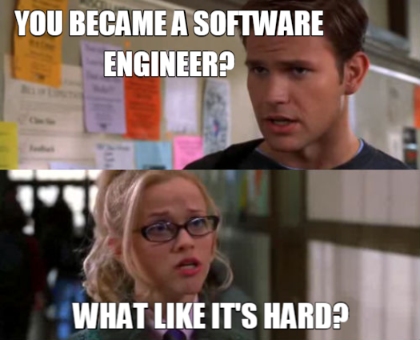

# Data Structures and Algorithms

These are the Fundamental Data Structures and Algorithms for a Software Engineer.

# Implementations

## Sorting

- [x] [Bubble Sort **O(n^2)**](lib/sorting/bubble_sort.c)
- [x] [Selection Sort **O(n^2)**](lib/sorting/selection_sort.c)
- [x] [Insertion Sort **O(n^2)**](lib/sorting/insertion_sort.c)
- [ ] Quick Sort **O(nlogn)**
- [ ] Merge Sort **O(nlogn)**
- [x] Heap Sort **O(nlogn)**
- [ ] Counting Sort **O(n + k)** _where k is a finite number_
- [ ] Radix Sort **O(n \* d)** _where d is the number of digits in the maximum number_
- [ ] Bucket Sort **O(n)**

## Trees

- [ ] AVL Trees
- [ ] Tries
- [ ] Binary Search Trees

## Graphs

- [ ] Breadth-First Search
- [ ] Depth-First Search
- [ ] Topological Sort
- [ ] mDFS
- [ ] Kahn's Algorithm
- [ ] Recurisve Backtracking
- [ ] Greedy Algorithms
- [ ] Making Change
- [ ] Minimum Spanning Trees
- [ ] Prim's ALgorithm
- [ ] Kruskal's Algorithm
- [ ] Huffman Coding
- [ ] Dijkstra's
- [ ] A\*

## Dynamic Programming

- [ ] Fibonacci
- [ ] Making Change
- [ ] Knapsack

# License

[MIT](LICENSE)
